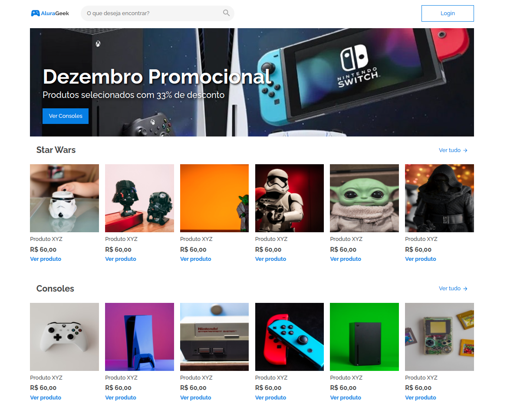
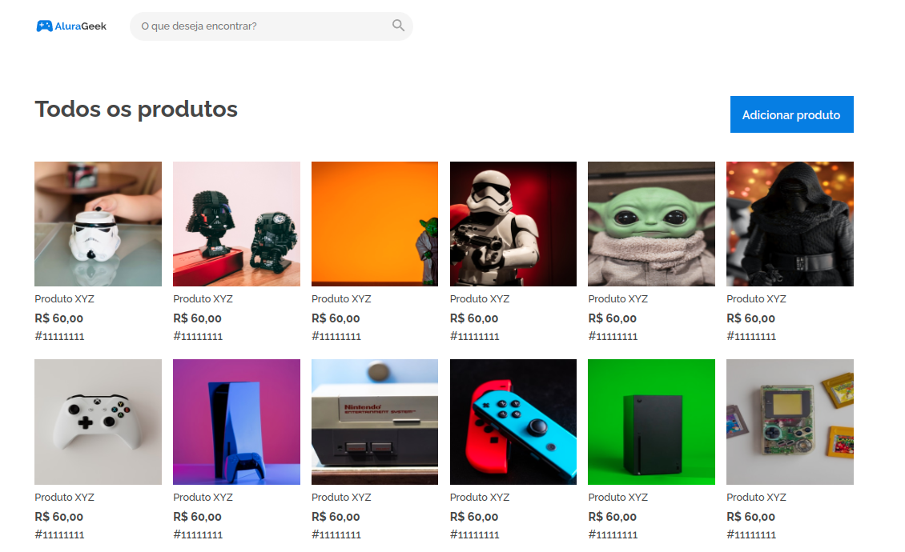
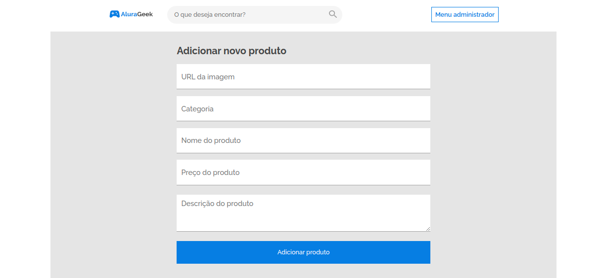
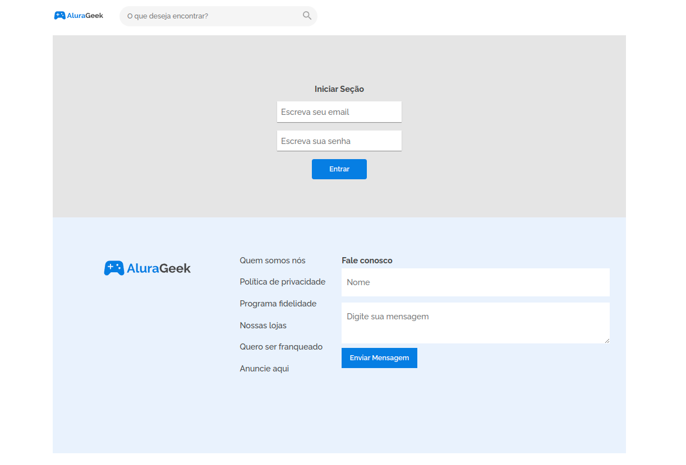
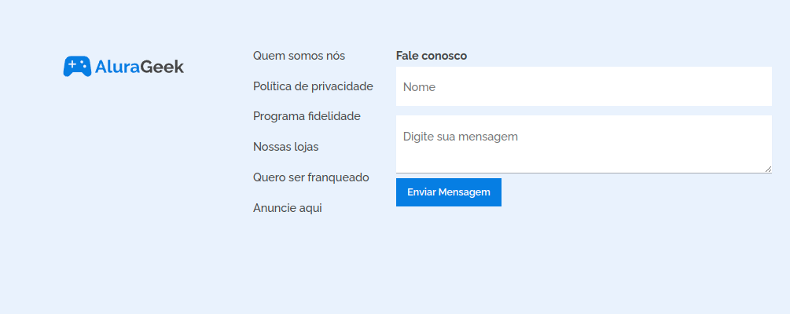

# Challenge Alura | E-commerce

> Este desafio Alura propôs a criação de um E-commerce. Nesta primeira sprint trabalhamos apenas com HTML e CSS, reproduzindo os laytouts do figma. Todas as páginas possuem formato responsivo para smartphones, tablets e desktops.
 

  

## Home

Página inicial.

  

## Todos os produtos

Página que apresenta todos os produtos disponíveis.

  

## Adicinar novo produto

Página para inserir um novo item na loja.

  

## Login

Tela de login para o administrador.

  

## Contato

Formulário de contato.

  

